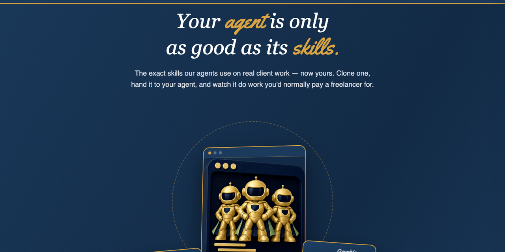
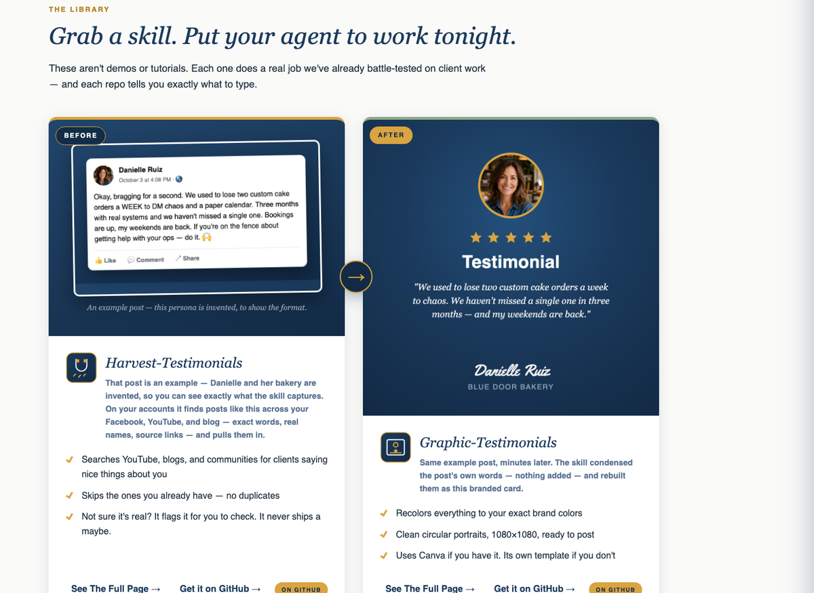

<p align="center">
  
</p>

<p align="center">
  <a href="https://myaifreedomsystems.github.io/incredagents-site/"></a>
  <a href="https://github.com/MyAiFreedomSystems"></a>
  <a href="https://github.com/MyAiFreedomSystems/incredagents"></a>
</p>

<p align="center"><b>Your agent is only as good as its skills.</b><br>
The exact skills our agents use on real client work — now yours. Clone one, hand it to your agent, and watch it do work you'd normally pay a freelancer for.</p>

---

<p align="center">
  
</p>

## What's here

This repo is the catalog and docs site for **IncredAgents** — production agent skills
(SKILL.md packages) for Claude Code, Kimi, and compatible agents. Every skill gets
its own page with a demo of its actual output.

**[Browse the catalog →](https://myaifreedomsystems.github.io/incredagents-site/)**

## The skills

### Standalone skills

| Skill | What it does | Repo | Page |
|---|---|---|---|
| **Harvest-Testimonials** | Finds the praise your clients already posted — YouTube, blogs, communities — with names, photos, and source links | [repo](https://github.com/MyAiFreedomSystems/harvest-testimonials) | [page](https://myaifreedomsystems.github.io/incredagents-site/skills/harvest-testimonials.html) |
| **Graphic-Testimonials** | Turns a quote, name, and photo into a branded 1080×1080 card — Canva if you have it, its own template if you don't | [repo](https://github.com/MyAiFreedomSystems/graphic-testimonials) | [page](https://myaifreedomsystems.github.io/incredagents-site/skills/graphic-testimonials.html) |
| **Testimonial-Display** | Placement patterns that put proof where buyers actually look | [repo](https://github.com/MyAiFreedomSystems/testimonial-display) | [page](https://myaifreedomsystems.github.io/incredagents-site/skills/testimonial-display.html) |
| **Logo-Theme-Manager** | Swap logos, favicons, and every stray hex code across a project from one manifest | [repo](https://github.com/MyAiFreedomSystems/logo-theme-manager) | [page](https://myaifreedomsystems.github.io/incredagents-site/skills/logo-theme-manager.html) |

### The mod pack — 12 skills, one install

Briefings, build teams, routing, provisioning, wrap-ups — the exact stack our agents run every day.

| | | |
|---|---|---|
| [Brief-Me](https://myaifreedomsystems.github.io/incredagents-site/skills/brief-me.html) | [Graphics](https://myaifreedomsystems.github.io/incredagents-site/skills/graphics.html) | [Goal](https://myaifreedomsystems.github.io/incredagents-site/skills/goal.html) |
| [Kaizen](https://myaifreedomsystems.github.io/incredagents-site/skills/kaizen.html) | [Pre-Build-SOP](https://myaifreedomsystems.github.io/incredagents-site/skills/pre-build-sop.html) | [Wrapup](https://myaifreedomsystems.github.io/incredagents-site/skills/wrapup.html) |
| [Moe-Build-Team](https://myaifreedomsystems.github.io/incredagents-site/skills/moe-build-team.html) | [Routing-Matrix](https://myaifreedomsystems.github.io/incredagents-site/skills/routing-matrix.html) | [Provision-Project](https://myaifreedomsystems.github.io/incredagents-site/skills/provision-project.html) |
| [Provision-Agent](https://myaifreedomsystems.github.io/incredagents-site/skills/provision-agent.html) | [Provision-Team](https://myaifreedomsystems.github.io/incredagents-site/skills/provision-team.html) | [Hooks-Guide](https://myaifreedomsystems.github.io/incredagents-site/skills/hooks-guide.html) |

**[Get the mod pack →](https://github.com/MyAiFreedomSystems/incredagents)**

## Install

```bash
# one skill
git clone https://github.com/MyAiFreedomSystems/harvest-testimonials.git

# or the whole pack
git clone https://github.com/MyAiFreedomSystems/incredagents.git
```

Clone into your agent's skills folder, tell it what you want in plain words. That's the whole setup.

## Also in this repo

- [`public-skills/pre-flight-check/`](public-skills/pre-flight-check/) — our pre-delivery quality-gate skill (packaged as `pre-flight-check.skill`)
- [`PIPELINE.md`](PIPELINE.md) — how a private skill earns its way into the public org: evaluate, scrub, document, package

---

If a skill saves you an hour, a ⭐ on its repo tells us to make more like it.

Built by [My AI Freedom Systems](https://github.com/MyAiFreedomSystems) · Part of the FreedomAIOS ecosystem
